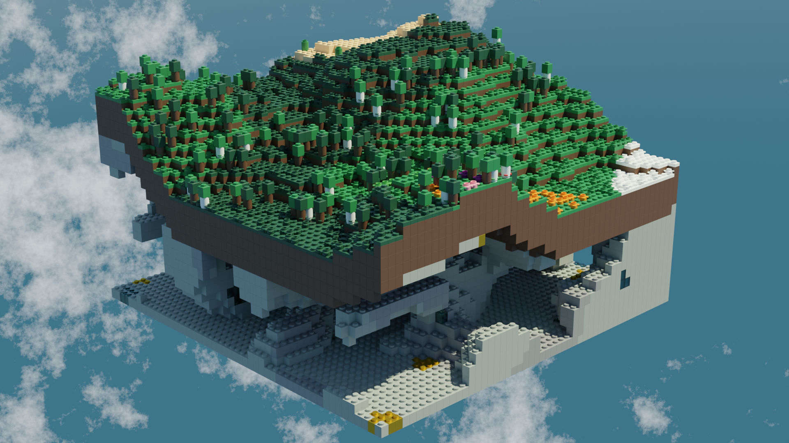

# TNM084 Project - Procedural terrain generation in Blender

A procedural terrain generator created natively in Blender, based on Minecraft world generation. Instead of building the world with cubes, each "block" is represented by a Lego [1 x 1 brick](https://www.bricklink.com/v2/catalog/catalogitem.page?P=3005#T=C), and the surface with a [1 x 1 plate](https://www.bricklink.com/v2/catalog/catalogitem.page?P=3024#T=C).

The terrain is created by modifying a cube using Geometry Nodes. The cube is replaced by a grid of modelled Lego bricks of desired size. Each piece is placed with varying height depending on the surface noise, creating valleys and mountains. There are several biomes supported created with smoothened Voronoi, creating the different biomes depending on the value of the colour output, mapped to a ColorRamp deciding the biome. The different biomes supported are:

- Plains, with grass (Part [33291](https://www.bricklink.com/v2/catalog/catalogitem.page?id=10780#T=C), green) scattered on the ground.
- Flower plains, similar to regular plains but with coloured grass pieces.
- Forests, with three different types of trees. Birch with with stem (Part [3062](https://www.bricklink.com/v2/catalog/catalogitem.page?P=3062#T=C)), trees with brown stem with two different colours for the leaves, dark and bright.
- Snow, also with the possibility to spawn trees with snow on top.
- Desert, with cacti (stacked Part 33291), random height.
- Mountains, altough not biome generated. When parts of the surfaces becomes high enough, it becomes a mountain with snow on top, and trees are removed, if existing.
- Lake/ocean, not biome driven either, when the surface is low enough (as low as it gets) the plates are replaced by blue ones.

The terrain consist of a dirt layer, with grass (or else depending on the biome) plates above. There is stone material underneath, with the possibility to have caves generated with 4D noise by just removing bricks at random. Some of the stone material bricks are replaced by pearl gold or transparent light blue to mimic gold and diamond ore.

All colours are accurate to regular lego pieces, using only parts that actually exist, so it would be possible to rebuild the terrain in real life.



All relevant settings for creating customised terrains can be changed through the control panel in the image below. It is accessed from the Modifier Properties tab. Some parts can be toggled off to modify the surface with less lag.

<p style="text-align:center;">
    
</p>

## Folder structure

```
.
├───Images          # Render images
├───Inspiration     # Images of lego structures for inspiration
├───main.blend      # The blender file
└───README.md
```

## Further development

There are some further features that could be added, and potential lag issue fixes:

- More advanced trees, that consist of vertical (SNOT) pieces. Possibly also trees in different sizes.
- Holes in the surface that leads down to the caves (similar to Minecraft).
- Procedural houses/villages.
- Merge Lego pieces where applicable. Instead of only placing 1 x 1 pieces, merge them into e.g. 3 x 2 bricks, 4 x 4 plates, etc.
- Remove pieces that are not visible, completely covered by other pieces (optimisation).
- Proper lake/ocean and mountain biome. Right now lakes and mountains are only created if the surface noise is low/high enough. A better version would make the height biome driven as well.
